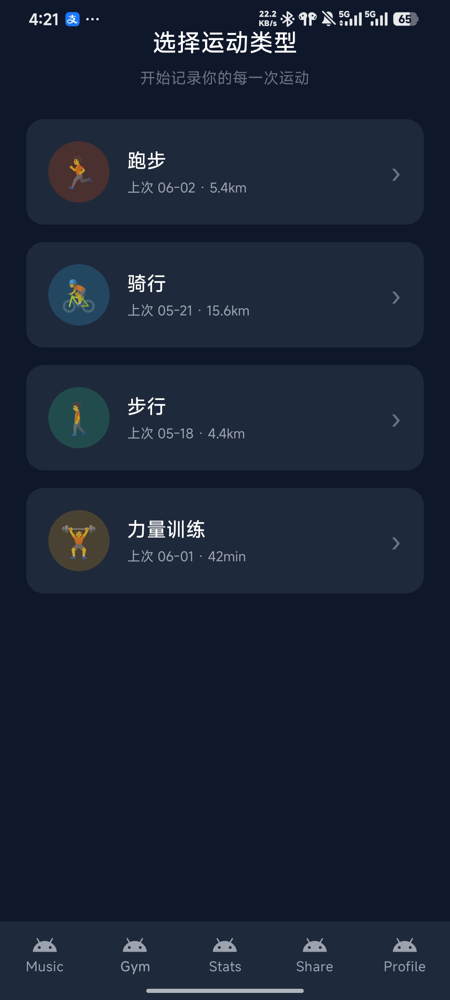
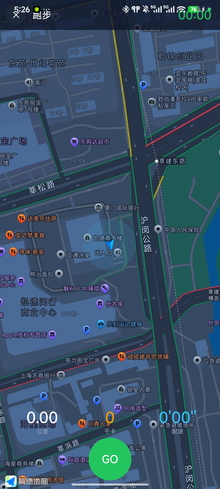
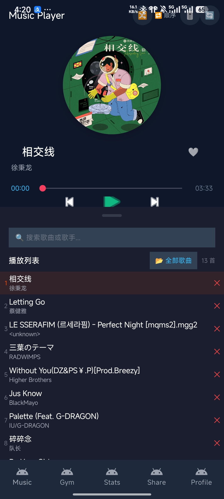
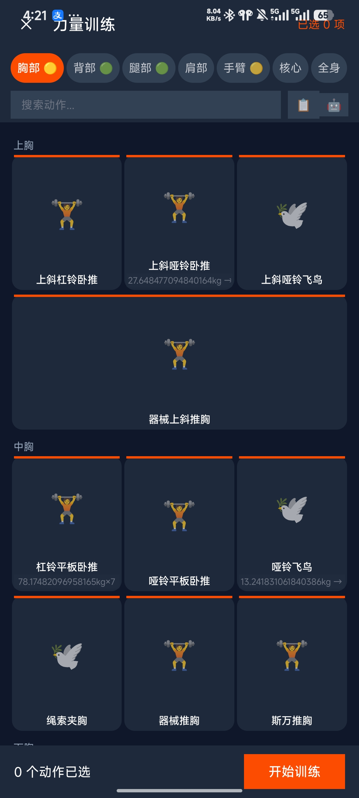
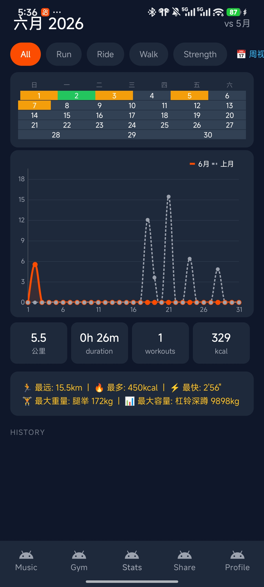
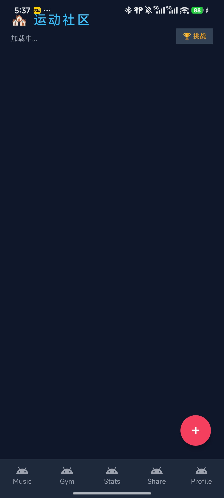
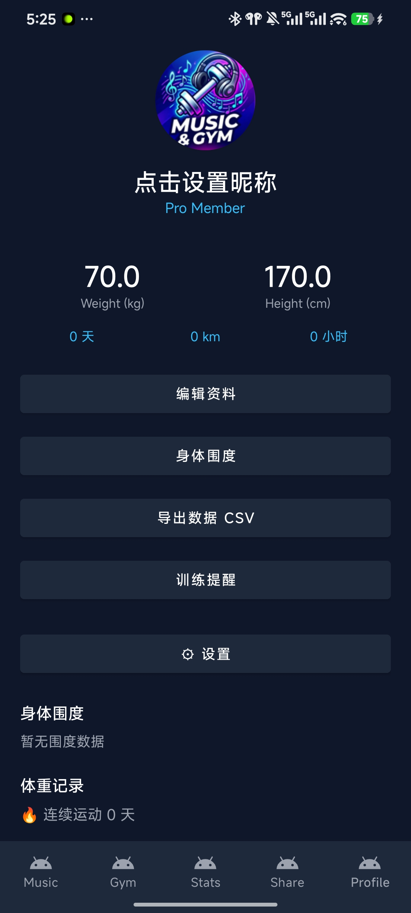

# MusicGym v5.2 🏃‍♂️🎵

**运动追踪 × 力量训练 × 本地音乐 × 社区社交 × AI 训练计划**

一站式健身记录 Android 应用

[](https://developer.android.com)
[](https://www.java.com)
[]()
[]()

---

## 📱 截图

<div align="center">
  
  
  
  
  
  
  
</div>

---

## 功能矩阵

| 模块 | 完成度 | 功能 |
|------|--------|------|
| 🏃 **运动追踪** | 92% | GPS实时追踪、配速着色路线、每公里语音播报、自动暂停、路线回放、运动中迷你音乐控制 |
| 🏋️ **力量训练** | 85% | 7肌群×50+动作、ViewPager2滑动训练、%1RM胶囊、组间休息计时、模板保存、🤖DeepSeek AI四周计划 |
| 🎵 **音乐播放** | 93% | 本地MP3扫描、3种播放模式、5段EQ均衡器、❤️收藏、BPM步频匹配、Gapless无缝播放、📂歌单管理 |
| 📊 **数据统计** | 80% | 日历热力图、MPAndroidChart折线图、周/月视图、5种运动过滤、趋势箭头、个人纪录墙、目标进度 |
| 👤 **个人中心** | 88% | 头像、体重趋势图、身体围度、CSV导出、训练提醒、成就徽章(9枚)、深色/浅色主题 |
| 🏘️ **社区** | 85% | Firebase帖子瀑布流、发帖(拍照+文字)、点赞评论、👥关注系统、🏆挑战排行、举报 |
| ⚙️ **系统** | 75% | 3页引导页、桌面Widget、通知权限请求、Release签名+ProGuard、数据库v5迁移 |

## 架构

```
┌──────────────────────────────────────────────┐
│                MainActivity (5 Tabs)           │
├──────┬──────┬──────────┬──────────┬───────────┤
│ GYM  │ MUSIC│  STATS   │ PROFILE  │  SHARE    │
│ MVVM │ MVVM │  MVVM    │ Fragment │ Fragment  │
├──────┴──────┴────┬─────┴──────────┴───────────┤
│                  AppDatabase                   │
│     Room v5 · 8 Entities · 7 DAOs             │
├──────────────────────────────────────────────┤
│  Firebase Firestore · SharedPreferences       │
│  AMap SDK · MPAndroidChart · Glide            │
└──────────────────────────────────────────────┘
```

## 技术栈

| 类别 | 技术 |
|------|------|
| 语言 | Java 11 |
| 架构 | MVVM (4 ViewModels) + Repository Pattern |
| 数据库 | Room v5 (8 entities, 5 migrations) |
| 地图 | 高德 3D 地图 SDK 10.0.600 |
| 图表 | MPAndroidChart 3.1.0 |
| 图片 | Glide 4.16.0 |
| AI | DeepSeek Chat API (训练计划生成) |
| 社交 | Firebase Firestore + Auth (匿名登录) |
| 构建 | Gradle · ProGuard/R8 · Release签名 |

## 项目结构

```
app/src/main/java/com/example/musicgym/
├── MainActivity.java             # 5-Tab 主框架
├── OnboardingActivity.java       # 首次引导页
│
├── StatsFragment.java            # 📊 MVVM统计
├── StatsViewModel.java / Repository.java
│
├── MusicFragment.java            # 🎵 MVVM音乐
├── MusicViewModel.java
├── MusicService.java             # 前台播放服务
│
├── GymFragment.java              # 🏃 MVVM运动入口
├── GymViewModel.java
├── WorkoutActivity.java          # GPS追踪
├── RoutePlaybackActivity.java    # 路线回放
│
├── StrengthActivity.java         # 🏋️ 力量动作库
├── StrengthWorkoutActivity.java  # 训练记录
├── ExercisePageAdapter.java      # ViewPager适配器
│
├── CommunityRepository.java      # 🏘️ Firebase数据层
├── ShareFragment.java            # 社区瀑布流
├── UserProfileActivity.java      # 用户主页
│
├── ProfileFragment.java          # 👤 个人中心
├── SettingsActivity.java         # ⚙️ 设置
│
├── AiPlanGenerator.java          # 🤖 DeepSeek AI
├── SeedDataManager.java          # Demo预置数据
├── AchievementManager.java       # 成就系统
│
├── AppDatabase.java              # Room v5 数据库
├── 8 Entity classes              # Playlist/BlogPost/WorkoutRecord/...
├── 7 DAO interfaces
│
├── ColorTokens.java              # 统一颜色常量
├── UiUtils.java                  # dp()/共享线程池
└── ThemeManager.java             # 深色/浅色切换
```

## 构建运行

```bash
# 1. 配置 API Key (local.properties)
AMAP_API_KEY=你的高德Key
DEEPSEEK_API_KEY=你的DeepSeek Key

# 2. 编译
./gradlew assembleDebugTest

# 3. 安装
adb install app/build/outputs/apk/debugTest/app-debugTest.apk
```

## 版本历史

| 版本 | 内容 |
|------|------|
| v1.x | 基础框架：音乐播放、GPS追踪、力量训练 |
| v2.x | 12项增强 + MVVM重构 + API Key安全注入 |
| v4.x | ProGuard + Widget + 横屏 + 死代码清理 |
| v5.0 | DeepSeek AI 训练计划 |
| v5.1 | API Key BuildConfig安全注入 |
| **v5.2** | **社区社交升级(关注+挑战+活动流) + 歌单管理 + Gapless + Demo预置数据 + minSdk降至26 + 5轮全面审计** |

---

## 质量评分

```
综合 88/100 B+
易用性 88  性能 86  可靠性 93  无障碍 83  可维护性 85  安全性 92
```

*2026 | MusicGym Team*
